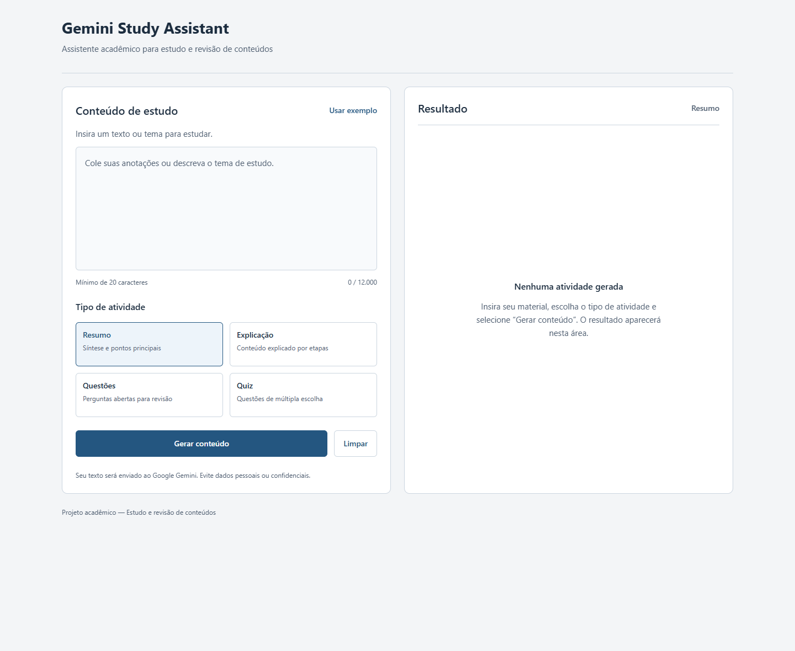

# Gemini Study Assistant

Assistente de estudos com integração real ao Google Gemini, API própria e interface React Native com Expo Web.

**Autores**
- Lucas Cabrio - 04723-133
- Paulo Esteves - 04723-090



## Objetivo
Transformar anotações e temas de estudo em materiais de compreensão e revisão. O estudante escolhe uma tarefa pedagógica, recebe uma resposta organizada e pode praticar com feedback imediato.

## Funcionalidades
- **Resumir:** resumo objetivo e pontos principais.
- **Explicar:** explicação didática com etapas.
- **Revisar:** de 2 a 5 perguntas abertas com respostas que podem ser reveladas.
- **Quiz:** de 2 a 5 questões, quatro alternativas distintas, correção após a seleção, explicação e pontuação final. Permite tentar novamente.
- Exemplo de conteúdo, limpeza, contador de caracteres, loading, prevenção de envios duplicados e mensagens de erro.
- Layout responsivo para navegador desktop e telas menores.

## Tecnologias
| Camada | Tecnologias |
| --- | --- |
| Frontend | React Native 0.86, Expo SDK 57, React 19, TypeScript, React Native Web |
| Backend | Node.js 22+, TypeScript, Express 5, Zod 4, Helmet, CORS, express-rate-limit |
| IA | SDK oficial `@google/genai`, Gemini 3.1 Flash-Lite, JSON Schema |
| Testes | Vitest, Supertest, Playwright |

O `package-lock.json` fixa as versões instaladas. Use Node.js 24 LTS, versão utilizada na validação.

## Arquitetura
```text
Usuário
   ↓
React Native / Expo Web
   ↓ HTTP + JSON
API Node.js / Express
   ↓ validação, regras e prompt específico
Google Gemini API
   ↓ JSON estruturado
API própria: parsing e validação de saída
   ↓
Frontend: resultado e quiz interativo
```

Detalhes e diagrama Mermaid: [docs/architecture.md](docs/architecture.md).

## Integração com Gemini
Somente o backend acessa o SDK oficial. Cada ação tem um prompt específico e esquema JSON próprio. O sistema orienta o modelo a usar português brasileiro, respeitar o tema/conteúdo, reconhecer incertezas e tratar instruções dentro do material como dados. O backend valida a resposta, incluindo número de questões, quatro alternativas distintas e índice correto de 0 a 3.

Modelo padrão: **`gemini-3.1-flash-lite`**. Foi consultado no catálogo da API e validado com chamadas reais. A [tabela oficial de preços](https://ai.google.dev/gemini-api/docs/pricing#gemini-3.1-flash-lite) informa camada gratuita para entrada e saída de texto (consulta em 04/10/2026). Disponibilidade e cotas dependem da conta. O modelo 2.5 Flash-Lite retornou indisponibilidade para novos usuários durante a verificação e não é o padrão do projeto. `GEMINI_MODEL` permite alteração sem editar código.

## Instalação
Pré-requisitos: Node.js 24 LTS, npm, Git, navegador e chave do [Google AI Studio](https://aistudio.google.com/apikey).

```bash
git clone https://github.com/LucasCabrio/gemini-study-assistant.git
cd gemini-study-assistant
npm ci
```

## Configuração
No PowerShell:
```powershell
Copy-Item backend/.env.example backend/.env
```
No macOS/Linux:
```bash
cp backend/.env.example backend/.env
```
Edite **somente** `backend/.env`:
```dotenv
GEMINI_API_KEY=
PORT=3001
GEMINI_MODEL=gemini-3.1-flash-lite
CORS_ORIGIN=http://localhost:8081
```
Preencha a chave localmente. `.env` e suas variantes estão ignorados pelo Git; apenas `.env.example` é versionado. Não coloque a chave em `EXPO_PUBLIC_*`, no frontend, em prints ou em documentos. O servidor responde 503 com mensagem segura quando falta a chave.

## Execução com Expo
Terminal 1, na raiz:
```bash
npm run dev:api
```
Terminal 2, na raiz:
```bash
npm run dev:web
```
Abra [http://localhost:8081](http://localhost:8081). Health check: [http://localhost:3001/health](http://localhost:3001/health). O health comprova que o servidor está vivo e informa se há uma chave configurada, mas não verifica a validade dela.

Se a rede bloquear apenas a consulta de versões do Expo, inicie o frontend offline no PowerShell:
```powershell
$env:EXPO_OFFLINE='1'
npm run dev:web
```
O backend ainda precisa de internet para acessar o Gemini.

### Celular com Expo
```bash
npm run start -w mobile
```
Use um cliente Expo Go compatível com SDK 57 ou um development build compatível. Para acessar o backend de outro dispositivo na mesma rede, crie `mobile/.env` a partir de `mobile/.env.example` e defina `EXPO_PUBLIC_API_URL=http://IP_DO_COMPUTADOR:3001`. Reinicie o Expo. `localhost` no celular aponta para o próprio celular. Permita a porta 3001 no firewall da rede local. A execução nativa em dispositivo físico não fez parte do QA desta entrega; o Expo Web foi validado em desktop e viewport móvel.

### Build
```bash
npm run build
npm run start -w backend
```
O primeiro comando compila a API em `backend/dist` e exporta a web em `mobile/dist`. Em uma implantação, sirva a exportação web com um servidor HTTP, configure `EXPO_PUBLIC_API_URL` antes do build e ajuste `CORS_ORIGIN` no backend. `.env` é carregado a partir da pasta de execução; os scripts de workspace iniciam a API na pasta `backend`.

## Endpoints
Todos os POSTs recebem `Content-Type: application/json`.

| Método | Rota | Entrada | `data` de sucesso |
| --- | --- | --- | --- |
| GET | `/health` | nenhuma | `status`, `geminiConfigured` |
| POST | `/api/study/summarize` | `content` | `title`, `summary`, `keyPoints[]` |
| POST | `/api/study/explain` | `content` | `title`, `explanation`, `steps[]` |
| POST | `/api/study/questions` | `content`, `count` opcional | `title`, `questions[{question,answer}]` |
| POST | `/api/study/quiz` | `content`, `count` opcional | `title`, `questions[{question,options,correctIndex,explanation}]` |

Exemplo de corpo:
```json
{"content":"A fotossíntese converte energia luminosa em energia química nas plantas.","count":3}
```
Sucesso: `{"success":true,"data":{...}}`.
Erro: `{"success":false,"error":{"code":"VALIDATION_ERROR","message":"..."}}`.

HTTP: 200 sucesso, 400 validação/JSON inválido, 404 ação/rota ausente, 413 corpo excessivo, 429 limite local ou Gemini, 502 serviço externo ou resposta inválida, 503 configuração/chave/modelo indisponível, 504 timeout e 500 erro interno sanitizado. Erros 429 incluem `Retry-After: 60` como orientação para nova tentativa, sem garantia de renovação da cota do provedor.

## Regras e validações
- Conteúdo obrigatório com 20 a 12.000 caracteres após normalização Unicode NFC, remoção de controles, normalização de quebras e trim.
- Campos desconhecidos não são aceitos. Não há execução de HTML, Markdown ou comandos do conteúdo.
- Quantidade inteira entre 2 e 5, padrão 3, permitida somente em perguntas/quiz.
- Quatro alternativas distintas, uma correta, número exato de questões e validação Zod da saída.
- Corpo HTTP limitado a 64 KB. Limite local de 10 solicitações/minuto por IP.
- Timeout do SDK de 30 s, sinal de cancelamento de 32 s e timeout do frontend de 38 s.
- Botão e campos bloqueados durante geração; trava síncrona impede envios duplicados.
- Sem stack traces, mensagens brutas do provedor, chaves ou conteúdo de estudo em logs.
- CORS limitado à origem configurada e cabeçalhos de segurança com Helmet.

## Estrutura
```text
backend/
  src/              # API, regras, prompts, SDK e erros
  tests/            # Testes unitários e HTTP com mocks
  .env.example
mobile/
  App.tsx           # Entrada mínima (5 linhas)
  src/
    components/     # Header, StudyInput, ActionSelector, ResultPanel,
                    # Quiz, ReviewQuestions, Loading e Button
    screens/Home/   # Composição da tela e estilos de layout
    hooks/          # Estado, geração, reset e respostas do quiz
    services/       # Chamada HTTP, timeout e erros da API
    types/          # Contratos tipados por atividade
    constants/      # Atividades, limites e conteúdo de exemplo
    theme/          # Cores, espaçamentos e tipografia
  index.ts          # Entrada Expo
  app.json
docs/
  architecture.md
  qa.md
  screenshots/      # Capturas reais no navegador
presentation/
  README.md         # Apresentação aguardando validação do código
scripts/
  smoke-gemini.mjs   # Smoke real dos quatro endpoints
  qa-web.mjs         # QA web com capturas
```

## Testes
```bash
npm test
npm run typecheck
npm run build
npm run format:check
```
Os testes do backend não acessam o Gemini: usam funções injetadas e mocks. Com os dois servidores ativos e a chave configurada:
```bash
node scripts/smoke-gemini.mjs
npm run qa:web
```
O QA web requer Google Chrome instalado. Para Edge, defina `QA_BROWSER=msedge` no ambiente. Ele usa Gemini real para gerar os quatro resultados e simula somente falhas de rede e rate limit para testar a UX. As capturas de conteúdo usam respostas reais. Execuções reais consomem cota. Veja os resultados em [docs/qa.md](docs/qa.md).

### Organização do frontend
`App.tsx` apenas renderiza `HomeScreen`. A tela compõe os componentes e adapta as colunas à largura disponível. `useStudyAssistant` concentra estado, validação de entrada, trava de envio, geração, limpeza, revelação de respostas e seleções do quiz. `services/api.ts` é o único local com `fetch`, timeout e tradução de erros de transporte. Os resultados usam uma união discriminada por ação, com contratos específicos para cada atividade.

Cada componente tem seu `styles.ts`, usando tokens de `theme/`. A identidade acadêmica usa azul discreto, branco e cinza, títulos diretos e cartões simples. Desktop exibe “Conteúdo de estudo” e “Resultado” lado a lado; no mobile, as áreas ficam empilhadas. A integração com IA aparece nas informações de uso e privacidade.

## Apresentação e limitações
A apresentação de seis slides será criada após a validação do código pelo usuário, conforme solicitado. As capturas reais já estão em `docs/screenshots/`.

Projeto acadêmico sem autenticação ou persistência. Conteúdo e resultados ficam apenas na memória do frontend, mas o texto é enviado ao Google e está sujeito aos termos do provedor. A interface orienta a evitar dados pessoais. IA pode errar e deve ser conferida com fontes e professor. Gabarito acompanha a resposta HTTP e só é revelado pela interface após seleção: não se trata de uma plataforma de provas seguras. Rate limit em memória é adequado à execução local de uma instância; produção pública precisaria autenticação, armazenamento compartilhado de limites e monitoramento.
