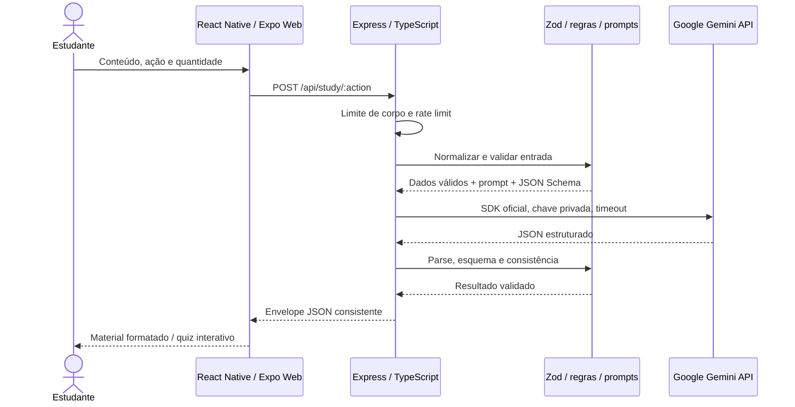

# Arquitetura do Gemini Study Assistant

- Lucas Cabrio - 04723-133
- Paulo Esteves - 04723-090

## Visão geral
Monorepo npm com dois workspaces. `mobile` contém a aplicação React Native/Expo, compartilhável entre web e plataformas nativas. `backend` contém a API própria Express. A separação mantém segredos e políticas de uso fora do bundle público.

## Frontend
Componentes React Native (`View`, `Text`, `TextInput`, `Pressable`, `ScrollView`) renderizados pelo React Native Web. Breakpoint de 940 px alterna duas colunas e uma coluna. Estado local controla entrada, ação, resultado, respostas do quiz e revelação das perguntas. `useRef` faz a trava imediata de requisições e os controles são desabilitados durante geração. Um `AbortController` encerra a espera após 38 segundos. Falha de rede, timeout e erros da API aparecem em área acessível com papel de alerta.

O quiz calcula acertos no frontend, bloqueia mudança após a escolha, exibe gabarito e justificativa, e permite recomeçar. O backend já envia o gabarito, portanto essa restrição é de interação, não de segurança de avaliações. Renderização usa apenas texto, sem `innerHTML`.

### Organização do frontend
- `App.tsx`: entrada com cinco linhas, apenas renderiza a tela.
- `screens/Home`: composição dos componentes e layout responsivo.
- `components`: cabeçalho, entrada, seleção de atividade, resultado, perguntas abertas, quiz, loading e botão reutilizado. Cada pasta mantém seu arquivo de estilos.
- `hooks/useStudyAssistant.ts`: estado e operações da sessão de estudo, incluindo loading, erros, geração, reset, revelação e escolhas do quiz.
- `services/api.ts`: único ponto de acesso HTTP, montagem do corpo conforme a ação, timeout e mensagens de transporte.
- `types/study.ts`: tipos de entrada, perguntas e resultados discriminados por ação.
- `constants`: catálogo de atividades, limites, quantidade e conteúdo de exemplo.
- `theme`: cores neutras/azul, espaçamento, raios, breakpoints e tipografia compartilhada.

Fluxo de dependências: a tela usa o hook e os componentes; o hook chama o serviço; componentes recebem dados e callbacks por props. Nenhum componente faz `fetch`. Estilos ficam nos arquivos `styles.ts`, e cores e tipografia vêm do tema. A separação mantém a integração HTTP e as regras de interação fora dos componentes de apresentação.

## Backend e regras
`app.ts` configura HTTP, segurança, CORS, parsing limitado, rate limit, rotas e middleware final de erros. A função `createApp` recebe o serviço por injeção para permitir testes isolados. `study.ts` concentra contratos, normalização, prompts e validação da saída. `gemini.ts` encapsula o SDK oficial e tradução de erros. `server.ts` lê o ambiente e inicia a aplicação.

O backend normaliza texto, impõe limites, recusa campos não previstos e impede uso de quantidade em ações sem perguntas. A saída deve corresponder ao esquema Zod, com número exato de questões, quatro opções distintas e índice de resposta válido. Não tenta corrigir silenciosamente JSON inválido nem substitui respostas reais por fixtures.

## Gemini
Modelo padrão `gemini-3.1-flash-lite`, confirmado no catálogo e por execução real em 04/10/2026. Prompts distintos fazem resumo, explicação, revisão e quiz. A instrução de sistema separa o material de comandos, pede português brasileiro, restringe o escopo e exige reconhecimento de incerteza. Tema permite conhecimentos consolidados pertinentes; texto fornecido é a referência para síntese. Isso reduz, mas não elimina, alucinação ou prompt injection.

O JSON Schema deriva do mesmo Zod usado no parsing. Temperatura 0,3 e teto de 4.096 tokens reduzem variabilidade e custo. O SDK tem timeout de 30 segundos e cancelamento de 32 segundos. Não há retry automático para evitar multiplicação de consumo. O usuário pode tentar novamente.

## Segurança e dados
`GEMINI_API_KEY` existe apenas no ambiente do backend. Os exemplos são vazios e `.env` está no `.gitignore`. O frontend recebe apenas URL pública da API. Código não registra chaves, texto estudado, respostas brutas ou erros sensíveis. Helmet adiciona cabeçalhos de proteção. CORS permite a origem configurada, mas não substitui autenticação.

Dados não são persistidos pela aplicação. O provedor recebe o material e pode tratá-lo conforme seus termos, inclusive políticas da camada gratuita. A UI informa essa transferência. Não utilize dados pessoais ou confidenciais. Não há autenticação, histórico nem armazenamento nesta versão.

## Tratamento de erros
Todas as rotas, incluindo 404, JSON malformado e excesso de corpo, seguem o envelope de erro. Exceções internas viram mensagem genérica 500. O SDK traduz indisponibilidade e resposta inválida em 502, configuração/autenticação/modelo em 503, timeout em 504 e cota em 429. Erros não expõem stacks ou mensagens brutas do Google.

Rate limit local: 10 solicitações por IP por minuto, em memória. Atrás de proxy, configurar `trust proxy` apenas para proxies conhecidos e adotar store distribuído se houver múltiplas instâncias. A aplicação não ativa confiança irrestrita em headers encaminhados.

## Verificação
Vitest/Supertest cobrem contratos, limites, prompts, erros do provedor e endpoints. Smoke real exercita as quatro ações. Playwright abre Expo Web, verifica loading, correção de quiz, revisão, limpeza, mensagens de erro e viewport móvel, salvando screenshots reais. Relatório em `qa.md`.

## Fontes
- [SDK oficial JavaScript](https://github.com/googleapis/js-genai)
- [Saídas estruturadas Gemini](https://ai.google.dev/gemini-api/docs/structured-output)
- [Preços e camada gratuita](https://ai.google.dev/gemini-api/docs/pricing)
